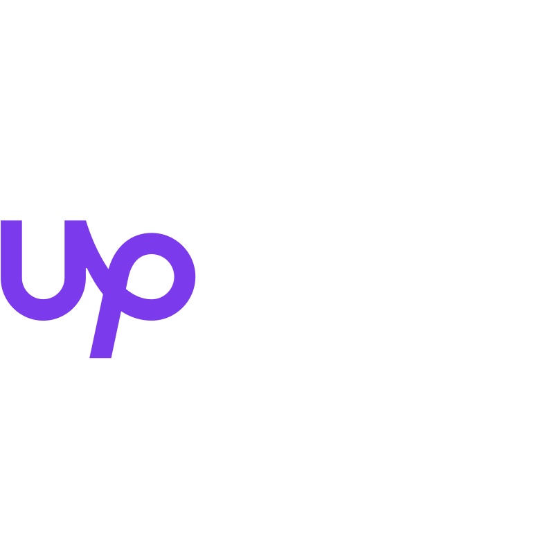
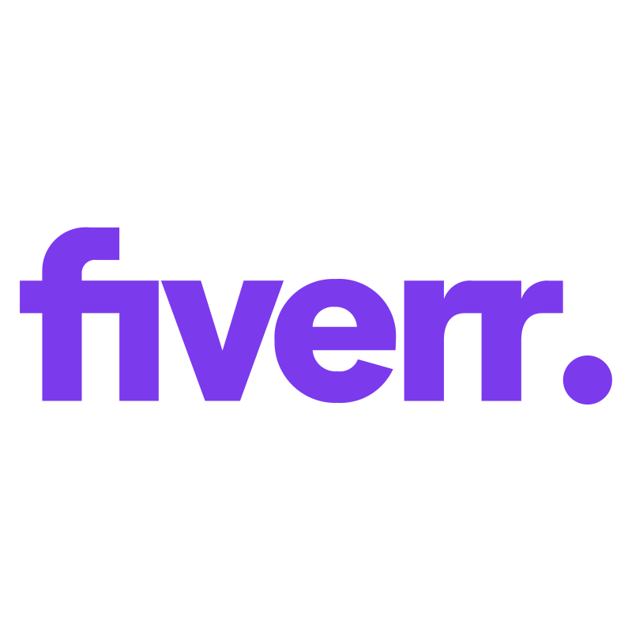

 
 

  

  

<!-- Social icons section -->

  
  &#8287;&#8287;&#8287;&#8287;&#8287;
  
  &#8287;&#8287;&#8287;&#8287;&#8287;
  
  &#8287;&#8287;&#8287;&#8287;&#8287;
  
  &#8287;&#8287;&#8287;&#8287;&#8287;
  
  &#8287;&#8287;&#8287;&#8287;&#8287;

 

## Hi there, I'm Nathan and I am a Software Engineer

- 🔭 Looking for Full Stack | Frontend | Backend Engineering Roles

- 🌱 Learning everything I can about TypeScript, React, and Next.js

- 🏗️ Building full stack applications with the PERN Stack, Shopify, and Wordpress/Webflow

## 🛠️ Languages and Tools

### Languages

  

### Frameworks

  

### Tools

  

<h2> 📊 Stats and Activity</h2>

<h3>💻 GitHub Profile Stats</h3>

  

   
  
  

 

<b>Note:</b> Top languages is only a metric of the languages my public code consists of and doesn't reflect experience or skill level.

<h3>⚡ Recent GitHub Activity</h3>
<!-- https://github.com/jamesgeorge007/github-activity-readme -->
<!--START_SECTION:activity-->
1. 🔒 Closed issue [#7](https://github.com/nathanrydel/react-jobly-v2/issues/7) in [nathanrydel/react-jobly-v2](https://github.com/nathanrydel/react-jobly-v2)
2. 🎉 Merged PR [#26](https://github.com/nathanrydel/react-jobly-v2/pull/26) in [nathanrydel/react-jobly-v2](https://github.com/nathanrydel/react-jobly-v2)
3. 🔒 Closed issue [#9](https://github.com/nathanrydel/react-jobly-v2/issues/9) in [nathanrydel/react-jobly-v2](https://github.com/nathanrydel/react-jobly-v2)
4. 🎉 Merged PR [#23](https://github.com/nathanrydel/react-jobly-v2/pull/23) in [nathanrydel/react-jobly-v2](https://github.com/nathanrydel/react-jobly-v2)
5. 💪 Opened PR [#22](https://github.com/nathanrydel/react-jobly-v2/pull/22) in [nathanrydel/react-jobly-v2](https://github.com/nathanrydel/react-jobly-v2)
<!--END_SECTION:activity-->

