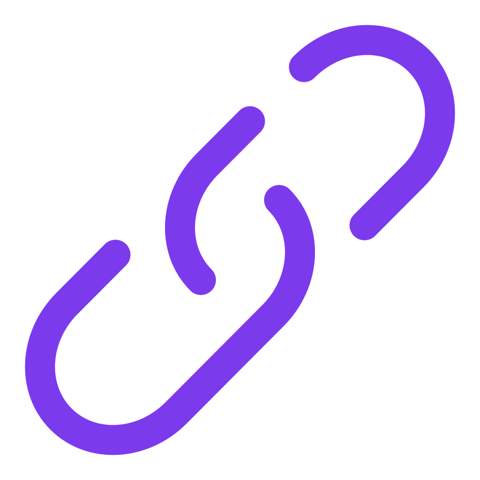

 
 

  

  

<!-- Social icons -->

  
  &#8287;&#8287;&#8287;&#8287;&#8287;
  
  &#8287;&#8287;&#8287;&#8287;&#8287;
  

 

## 👋 Professional Profile

**Full Stack Developer** with **2+ years** building scalable web apps and **7+ years** in technical support/DevOps. I bridge cutting-edge engineering with real-world usability through:

- ✔ **Full-Stack Development** - React, Vue, Next.js, TypeScript, Python, Go
- ✔ **AI Integrations** - LLM ecosystems, data pipelines, and predictive analytics
- ✔ **Cloud & DevOps** - AWS, Azure, Docker, CI/CD automation
- ✔ **Problem-Solving** - Debugging complex systems (ex-Apple, Accenture)

**Open to roles in:**
- Software Engineering (Full-Stack/Frontend/Backend)
- AI/ML Engineering
- DevOps & Cloud Solutions
- Technical Consulting

🔗 **Portfolio:** [nathanrydel.dev](https://nathanrydel.dev) | **Blog:** [Coming Soon](#)

## 🛠️ Core Technologies

### Languages

  

### Frameworks & Tools

  

### Specializations

  
  
  

<h2>📊 GitHub Stats</h2>

  

<b>Note:</b> Top languages is only a metric of the languages in my public code and doesn't reflect experience or skill level with the language.

<h3>⚡ Recent GitHub Activity</h3>

<!-- https://github.com/jamesgeorge007/github-activity-readme -->
<!--START_SECTION:activity-->

1. ❗ Opened issue [#13](https://github.com/nathanrydel/go-todo-app/issues/13) in [nathanrydel/go-todo-app](https://github.com/nathanrydel/go-todo-app)
2. ❗ Opened issue [#12](https://github.com/nathanrydel/go-todo-app/issues/12) in [nathanrydel/go-todo-app](https://github.com/nathanrydel/go-todo-app)
3. ❗ Opened issue [#11](https://github.com/nathanrydel/go-todo-app/issues/11) in [nathanrydel/go-todo-app](https://github.com/nathanrydel/go-todo-app)
4. ❗ Opened issue [#10](https://github.com/nathanrydel/go-todo-app/issues/10) in [nathanrydel/go-todo-app](https://github.com/nathanrydel/go-todo-app)
5. ❗ Opened issue [#9](https://github.com/nathanrydel/go-todo-app/issues/9) in [nathanrydel/go-todo-app](https://github.com/nathanrydel/go-todo-app)
<!--END_SECTION:activity-->

  
<h4>👓Views</h4>

  <!-- https://komarev.com/sources/github-profile-views-counter -->
  

